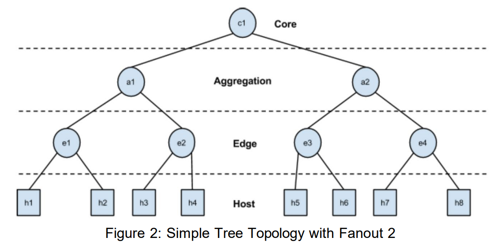

# Introduction

Ce laboratoire réalisé dans le cours de virtualisation de réseaux informatiques permet d'apprendre à utiliser Mininet et son API Python. Enfin, il est demandé de créer un réseau virtuel avec une topologie en arbre.

# Partie 1 : topologie linéaire

Dans cette première partie, un script python est fourni. Il utilise l'API Python de mininet pour créer un réseau virtuel avec une topologie linéaire. Chaque host est connecté à un switch, et les switch sont connectés entre eux de manière linéaire : s1 <-> s2 <-> ... <-> sk. L'exécution de ce script donne le résultat suivant

```bash
mininet@mininet-vm:~/labo2$ sudo python LinearTopology.py
*** Creating network
*** Adding controller
*** Adding hosts:
h1 h2 h3 h4
*** Adding switches:
s1 s2 s3 s4
*** Adding links:
(h1, s1) (h2, s2) (h3, s3) (h4, s4) (s2, s1) (s3, s2) (s4, s3)
*** Configuring hosts
h1 h2 h3 h4
*** Starting controller
c0
*** Starting 4 switches
s1 s2 s3 s4 ...
Dumping host connections
h1 h1-eth0:s1-eth1
h2 h2-eth0:s2-eth1
h3 h3-eth0:s3-eth1
h4 h4-eth0:s4-eth1
Testing network connectivity
*** Ping: testing ping reachability
h1 -> h2 h3 h4
h2 -> h1 h3 h4
h3 -> h1 h2 h4
h4 -> h1 h2 h3
*** Results: 0% dropped (12/12 received)
*** Stopping 1 controllers
c0
*** Stopping 7 links
.......
*** Stopping 4 switches
s1 s2 s3 s4
*** Stopping 4 hosts
h1 h2 h3 h4
*** Done
```

Chacun des host a réussi le ping vers les autres. Aucun paquet n'a été perdu. Le réseau est donc fonctionnel.

# Partie 2 : paramètres de performance

L'API de mininet permet de configurer le réseau pour ajouter des paramètre de performance. Les paramètres d'un `link` les plus intéressant sont :

- `bw` : la bande passante de la liaison, en Mb/s
- `delay` : le temps de transfert d'un bit sur la liaison, exprimé en unité de temps (s, ms, ...)
- `loss` : le taux de pertes des paquets, exprimé en pourcentage
- `max_queue_size` taille maximale de la queue, exprimé en paquets

On peu aussi définir le paramètre `cpu` d'un host qui défini quelle fraction des resources CPU du système seront accordé à ce host.

Si l'on reprend la partie 1 du labo, et que l'on défini certains paramètres dans les méthodes `addLink` et `addHost`, on peut voir les performances du réseau varier.

## Paramètres

```python
for i in irange(1, k):
    host = self.addHost('h%s' % i, cpu=0.5/k)
    switch = self.addSwitch('s%s' % i)
    # 10 Mbps, 5ms delay, 1% loss, 1000 packet queue
    self.addLink( host, switch, bw=10, delay='5ms', loss=1, max_queue_size=1000, use_htb=True)
    if lastSwitch != None:
        self.addLink(switch, lastSwitch, bw=10, delay='5ms', loss=1, max_queue_size=1000, use_htb=True)
    lastSwitch = switch
```

## Résultats

```bash
mininet@mininet-vm:~/labo2$ sudo python LinearTopologyP.py
*** Creating network
*** Adding controller
*** Adding hosts:
h1 h2 h3 h4
*** Adding switches:
s1 s2 s3 s4
*** Adding links:
(10.00Mbit 5ms delay 1% loss) (10.00Mbit 5ms delay 1% loss) (h1, s1) (10.00Mbit 5ms delay 1% loss) (10.00Mbit 5ms delay 1% loss) (h2, s2) (10.00Mbit 5ms delay 1% loss) (10.00Mbit 5ms delay 1% loss) (h3, s3) (10.00Mbit 5ms delay 1% loss) (10.00Mbit 5ms delay 1% loss) (h4, s4) (10.00Mbit 5ms delay 1% loss) (10.00Mbit 5ms delay 1% loss) (s2, s1) (10.00Mbit 5ms delay 1% loss) (10.00Mbit 5ms delay 1% loss) (s3, s2) (10.00Mbit 5ms delay 1% loss) (10.00Mbit 5ms delay 1% loss) (s4, s3)
*** Configuring hosts
h1 (cfs 12500/100000us) h2 (cfs 12500/100000us) h3 (cfs 12500/100000us) h4 (cfs 12500/100000us)
*** Starting controller
c0
*** Starting 4 switches
s1 s2 s3 s4 ...(10.00Mbit 5ms delay 1% loss) (10.00Mbit 5ms delay 1% loss) (10.00Mbit 5ms delay 1% loss) (10.00Mbit 5ms delay 1% loss) (10.00Mbit 5ms delay 1% loss) (10.00Mbit 5ms delay 1% loss) (10.00Mbit 5ms delay 1% loss) (10.00Mbit 5ms delay 1% loss) (10.00Mbit 5ms delay 1% loss) (10.00Mbit 5ms delay 1% loss)
Dumping host connections
h1 h1-eth0:s1-eth1
h2 h2-eth0:s2-eth1
h3 h3-eth0:s3-eth1
h4 h4-eth0:s4-eth1
Testing network connectivity
*** Ping: testing ping reachability
h1 -> h2 h3 h4
h2 -> h1 h3 h4
h3 -> h1 h2 h4
h4 -> h1 X h3
*** Results: 8% dropped (11/12 received)
Testing bandwidth between h1 and h4
*** Iperf: testing TCP bandwidth between h1 and h4
*** Results: ['1.61 Mbits/sec', '2.04 Mbits/sec']
*** Stopping 1 controllers
c0
*** Stopping 7 links
.......
*** Stopping 4 switches
s1 s2 s3 s4
*** Stopping 4 hosts
h1 h2 h3 h4
*** Done
```

On peut voir que l'hôte h4 n'a pas pu pinger h2. Un paquet a été perdu. Cela est dù au paramètre `loss`. De plus, les performances ont été calculé entre h1 et h4, et les débits sont les suivants :

- Server : 1.61 Mbits/sec
- Client : 2.04 Mbits/sec

# Partie 3 : topologie custom

## Topologie

La topologie du réseau en arbre a les propriétés suivantes :

- Un seul core switch
- `fanout` fois aggregations switch
- `fanout`$^2$ fois edge switch
- `fanout`$^3$ fois host



## Initialisation

Pour créer cette topologie, il faut exécuter l'algorithme suivant :

1. Création du core switch
2. Boucle pour créer les aggregation switch
   - link avec le core switch
3. Boucle imbriquée pour la création des edge switch
   - link avec le aggregation switch parent
4. Boucle imbriquée pour créer les hosts
   - link avec le edge switch parent

### Code

Cet algorithme implémenté en python donne le code ci-dessous. On voit bien les 3 boucles imbriquées.

```python
core = self.addSwitch('c1')
for i in range(fanout):
    agg_switch = self.addSwitch('a%s' % (i+1))
    self.addLink(agg_switch, core, **linkopts1)
    for j in range(fanout):
        edge_switch = self.addSwitch('e%s' % (j+fanout*i + 1))
        self.addLink(edge_switch, agg_switch, **linkopts2)
        for k in range(fanout):
            host = self.addHost('h%s' % (k+j*fanout+i*fanout**2 + 1))
            self.addLink(host, edge_switch, **linkopts3)
```

### Noms des switch et hosts

Pour définir le nom (numéro) d'un switch ou d'un host, il faut se baser sur les indices des boucles.

- Pour les switch du niveau aggrégation, c'est simplement l'indice de la boucle.
- Pour les switch du niveau edge, il faut utiliser l'indice de la deuxième boucle, et ajouter le nombre de switch déjà créé sur ce niveau, en utilisant l'indice de la première boucle. $n = i_2 + i_1 * f$
- Enfin, pour les hosts il faut faire un calcul impliquant tous les indices : $n = i_3 + i_2 * f + i_1 * f^2$

$f$ : fanout, $i_1$ : indice première boucle, $i_2$ : indice première boucle, $i_3$ : indice troisième boucle

## Résultats

### Exécution

Lors de l'exécution du script avec les paramètres suivants :

```python
linkopts1 = dict(bw=1000, delay='1ms')
linkopts2 = dict(bw=100, delay='10ms')
linkopts3 = dict(bw=10, delay='20ms')
fanout = 2
```

on peut voir l'output suivant dans la console :

```bash
mininet@mininet-vm:~/labo2$ sudo python CustomTopology.py
*** Creating network
*** Adding controller
*** Adding hosts:
h1 h2 h3 h4 h5 h6 h7 h8
*** Adding switches:
a1 a2 c1 e1 e2 e3 e4
*** Adding links:
(1000.00Mbit 1ms delay) (1000.00Mbit 1ms delay) (a1, c1) (1000.00Mbit 1ms delay) (1000.00Mbit 1ms delay) (a2, c1) (100.00Mbit 10ms delay) (100.00Mbit 10ms delay) (e1, a1) (100.00Mbit 10ms delay) (100.00Mbit 10ms delay) (e2, a1) (100.00Mbit 10ms delay) (100.00Mbit 10ms delay) (e3, a2) (100.00Mbit 10ms delay) (100.00Mbit 10ms delay) (e4, a2) (10.00Mbit 20ms delay) (10.00Mbit 20ms delay) (h1, e1) (10.00Mbit 20ms delay) (10.00Mbit 20ms delay) (h2, e1) (10.00Mbit 20ms delay) (10.00Mbit 20ms delay) (h3, e2) (10.00Mbit 20ms delay) (10.00Mbit 20ms delay) (h4, e2) (10.00Mbit 20ms delay) (10.00Mbit 20ms delay) (h5, e3) (10.00Mbit 20ms delay) (10.00Mbit 20ms delay) (h6, e3) (10.00Mbit 20ms delay) (10.00Mbit 20ms delay) (h7, e4) (10.00Mbit 20ms delay) (10.00Mbit 20ms delay) (h8, e4)
*** Configuring hosts
h1 h2 h3 h4 h5 h6 h7 h8
*** Starting controller
c0
*** Starting 7 switches
a1 a2 c1 e1 e2 e3 e4 ...(1000.00Mbit 1ms delay) (100.00Mbit 10ms delay) (100.00Mbit 10ms delay) (1000.00Mbit 1ms delay) (100.00Mbit 10ms delay) (100.00Mbit 10ms delay) (1000.00Mbit 1ms delay) (1000.00Mbit 1ms delay) (100.00Mbit 10ms delay) (10.00Mbit 20ms delay) (10.00Mbit 20ms delay) (100.00Mbit 10ms delay) (10.00Mbit 20ms delay) (10.00Mbit 20ms delay) (100.00Mbit 10ms delay) (10.00Mbit 20ms delay) (10.00Mbit 20ms delay) (100.00Mbit 10ms delay) (10.00Mbit 20ms delay) (10.00Mbit 20ms delay)
Dumping host connections
h1 h1-eth0:e1-eth2
h2 h2-eth0:e1-eth3
h3 h3-eth0:e2-eth2
h4 h4-eth0:e2-eth3
h5 h5-eth0:e3-eth2
h6 h6-eth0:e3-eth3
h7 h7-eth0:e4-eth2
h8 h8-eth0:e4-eth3
Testing network connectivity
*** Ping: testing ping reachability
h1 -> h2 h3 h4 h5 h6 h7 h8
h2 -> h1 h3 h4 h5 h6 h7 h8
h3 -> h1 h2 h4 h5 h6 h7 h8
h4 -> h1 h2 h3 h5 h6 h7 h8
h5 -> h1 h2 h3 h4 h6 h7 h8
h6 -> h1 h2 h3 h4 h5 h7 h8
h7 -> h1 h2 h3 h4 h5 h6 h8
h8 -> h1 h2 h3 h4 h5 h6 h7
*** Results: 0% dropped (56/56 received)
Testing bandwidth between h1 and h8
*** Iperf: testing TCP bandwidth between h1 and h8
*** Results: ['9.08 Mbits/sec', '13.1 Mbits/sec']
*** Stopping 1 controllers
c0
*** Stopping 14 links
..............
*** Stopping 7 switches
a1 a2 c1 e1 e2 e3 e4
*** Stopping 8 hosts
h1 h2 h3 h4 h5 h6 h7 h8
*** Done
```

### Observations

Les 8 hosts, 4 edge switch, 2 aggregation switch et 1 core switch ont été correctement créés, démarrés, utilisé et arrêtés, comme attendu. On voit que les ping ont tous réussi, tous les hosts peuvent se pinger entre eux. De plus, aucun paquet n'a été perdu. On peut voir que les différents hôtes sont connectés au bon switch selon la topologie que l'on a défini. Les noms des hosts et switch sont également fidèles la figure \ref{topology}.

## Conclusion

Le réseau virtuel créé est fonctionnel. Tous les hosts peuvent accéder les uns aux autres. La topologie demandée est respectée.
