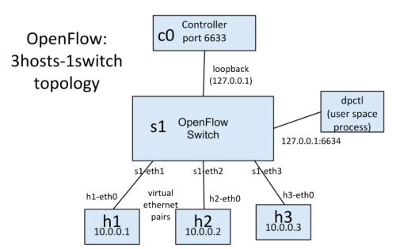
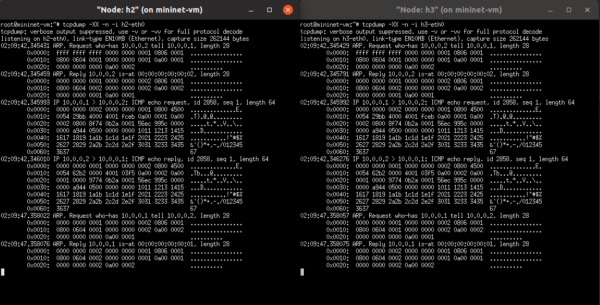
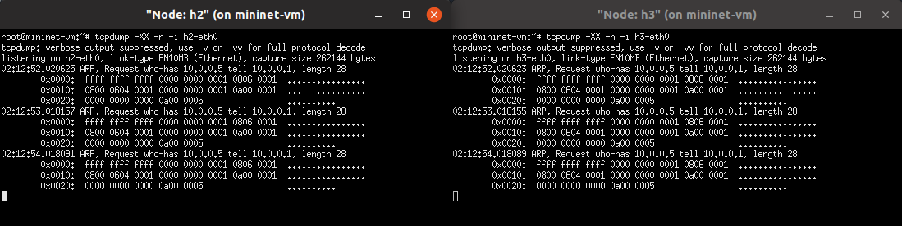
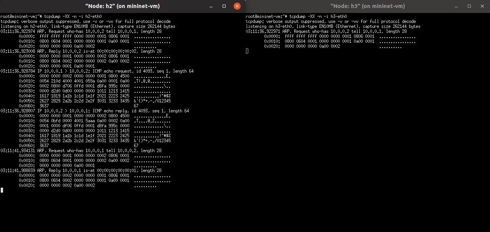

# Introduction

Dans ce labo nous allons mettre en place un controller POX et écrire un application de firewall pour le réseau à la topologie suivante :



Tout d'abord, nous allons lancer un controller simple qui fonctionne comme un hub. Il broadcast tous les paquets qu'il reçoit. L'implémentation du hub est déjà disponible dans POX.

Ensuite nous allons lancer un controller qui fonctionne comme learning switch. L'implémentation est également disponible dans POX.

Enfin, nous allons créer un controller avec un firewall intégré. On reprend le learning switch comme implémentation de base et on ajoute un module de firewall, implémenté nous même.

# Partie 1 : Hub

Lorsqu'on lance le hub, on peut voir avec la commande `tcpdump` sur les hosts h2 et h3 que tous les paquets sont visibles par ces hosts.



Si l'on ping un host inexistant, on voit des requêtes ARP sans réponse depuis tous les hosts



# Partie 2 : Learning switch

Le learning switch va apprendre, au fur et à mesure des paquets qui passent, quels hosts (adresse MAC) sont sur quels ports. Au début, quand il n'a pas connaissance du réseau, il fonctionne comme un hub.



On peut voir dans la capture d'écran que h3, qui n'est pas concerné par ce ping, reçoit uniquement la première requête ARP, qui a été broadcasté par le switch. Le reste du traffic reste entre h1 et h2.

# Partie 3 : Firewall

Dans cette partie, on ajoute un module firewall au learning switch. Les règles du firewall sont décrites dans un fichier CSV. Lors de la connexion d'un switch au controller, le controller installera des règles sur ce switch d'après les règles spécifiées dans le fichier CSV. Chaque entrée dans ce fichier est une règle pour interdire la communication entre 2 device.

## Règles du firewall (fichier CSV)

```csv
id,mac_0,mac_1
1,00:00:00:00:00:01,00:00:00:00:00:02
```

La seule règle du fichier interdit la communication entre h1 et h2.

## Code

```python
global policies

with open(policyFile, 'rb') as csvfile:
    reader = csv.DictReader(csvfile)
    policies = [d for d in reader]


class Firewall (EventMixin):

    def __init__ (self):
        self.listenTo(core.openflow)
        log.debug("Enabling Firewall Module")

    def _handle_ConnectionUp (self, event):
        for policy in policies:
            mac_0 = EthAddr(policy['mac_0'])
            mac_1 = EthAddr(policy['mac_1'])

            fm = of.ofp_flow_mod()
            fm.match.dl_src = mac_0
            fm.match.dl_dst = mac_1
            fm.priority = 10
            event.connection.send(fm)

            fm = of.ofp_flow_mod()
            fm.match.dl_src = mac_1
            fm.match.dl_dst = mac_0
            fm.priority = 11
            event.connection.send(fm)

        log.debug("Firewall rules installed on %s", dpidToStr(event.dpid))
```

On utilise le champ `match` de `ofp_flow_mod()` pour écrire les adresses MAC sources et destination spécifiés dans les règles. Ensuite, lors de l'arrivée d'un paquet, si les adresses MAC sources et destination corrsepondent à ce champ `match`, alors le paquet n'est pas transmis.

## Test du code

```bash
mininet> pingall
*** Ping: testing ping reachability
h1 -> X h3
h2 -> X h3
h3 -> h1 h2
*** Results: 33% dropped (4/6 received)
```

h1 et h2 ne peuvent pas communiquer, comme attendu.
