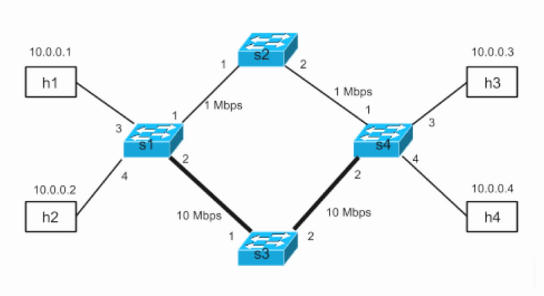
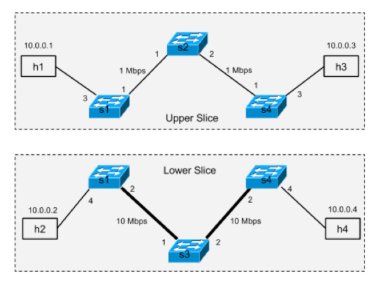
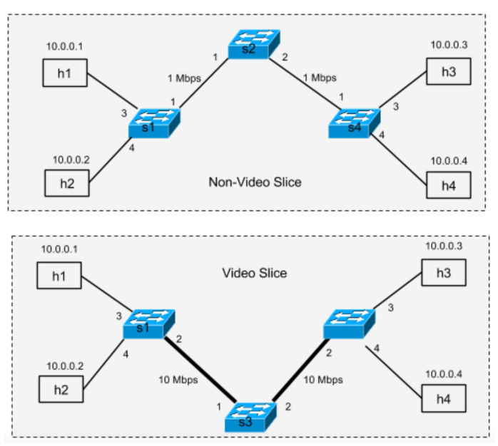

# Introduction

Dans ce labo, on s'intéresse à partitionner un réseau OpenFlow directement avec POX. On souhaite créer une application qui va séparer un réseau couche en différentes portions.

Nous allons voir deux types de séparations du réseau :

1. Basé sur la topologie
2. Basé sur le traffic

# Topologie



Les chemins ont des bandes passante différentes. Le chemin par le switch s2 a une faible bande passante et le chemin par le switch s3 en a une haute.

On utilise le script fourni `mininetSlice.py` pour créer un réseau avec cette topologie dans mininet.

# Part 1 : Topology-based Slicing

Dans cette partie on veut séparer notre réseau en deux sous-réseau comme dans le schéma suivant :



La _upper slice_ relie h1 à h3 en passant par s2 et la _lower slice_ relie h2 à h4 en passant par s3. Les paquets d'une _slice_ ne peuvent pas en sortir.

## Code

Le code complet est disponible en annexe.

```python
class TopologySlice(EventMixin):
    def __init__(self):
        self.listenTo(core.openflow)
        log.debug("Enabling Slicing Module")

    def set_output(self, out_port, in_port, event):
        fm = of.ofp_flow_mod()
        fm.match.in_port = in_port
        fm.actions.append(of.ofp_action_output(port=out_port))
        event.connection.send(fm)

    def _handle_ConnectionUp(self, event):

        dpid = dpidToStr(event.dpid)
        log.debug("Switch %s has come up.", dpid)

        if "1" in dpid:
            self.set_output(1, 3, event)
            self.set_output(3, 1, event)
            self.set_output(4, 2, event)
            self.set_output(2, 4, event)
        if "2" in dpid:
            self.set_output(1, 2, event)
            self.set_output(2, 1, event)
        if "3" in dpid:
            self.set_output(1, 2, event)
            self.set_output(2, 1, event)
        if "4" in dpid:
            self.set_output(1, 3, event)
            self.set_output(3, 1, event)
            self.set_output(4, 2, event)
            self.set_output(2, 4, event)
```

Pour chaque switch (défini par leur id : 1, 2, 3 ou 4) on spécifie le port sur lequel envoyé le paquet en fonction du port d'entrée de celui-ci. Par exemple, pour s1, si le paquet arrive du port 4, et donc de h2, on l'envoie sur le port 2, et inversement pour une communication bidirectionnelle. Par contre si le paquet vient du port 3, et donc de h1, il faut l'envoyer sur le port 1 et inversement.

## Test du code

```bash
mininet> pingall
*** Ping: testing ping reachability
h1 -> X h3 X
h2 -> X X h4
h3 -> h1 X X
h4 -> X h2 X
*** Results: 66% dropped (4/12 received)
```

On peut voir que h1 communique uniquement avec h3 et h2 uniquement avec h4, comme on le souhaitait.

# Part 2 : Flowspace Slicing

Dans cette partie, contrairement à la première, on souhaite créer des slice basées sur l'application qui génère le traffic. On veut que le traffic vidéo passe par le switch s3 et le reste du traffic par le switch s2. L'idée est de faire passer le flux vidéo par un liaison à haute bande passante et le reste du traffic par l'autre chemin. Il ne sera ainsi pas perturbé par le traffic vidéo.

Concrètement, on défini que le traffic vidéo se passe sur le port 80 et le reste du traffic sur tous les autres ports. On va donc séparer le traffic en fonction du port applicatif du paquet.

La séparation peut être représenté par ce schéma :



## Code

Le code complet est disponible en annexe.

```python
class VideoSlice(EventMixin):
    def __init__(self):
        self.listenTo(core.openflow)
        core.openflow_discovery.addListeners(self)

        # Adjacency map.  [sw1][sw2] -> port from sw1 to sw2
        self.adjacency = defaultdict(lambda: defaultdict(lambda: None))

        """
        The structure of self.portmap is a four-tuple key and a string value.
        The type is:
        (dpid string, src MAC addr, dst MAC addr, port (int)) -> dpid of next switch
        """

        self.portmap = {
            # VIDEO (tcp port 80)
            # h1 -> h3
            (
                "00-00-00-00-00-01",
                EthAddr("00:00:00:00:00:01"),
                EthAddr("00:00:00:00:00:03"),
                80,
            ): "00-00-00-00-00-03",
            (
                "00-00-00-00-00-03",
                EthAddr("00:00:00:00:00:01"),
                EthAddr("00:00:00:00:00:03"),
                80,
            ): "00-00-00-00-00-04"
            # ...
            # Suite en annexe
        }
        self.porttohost = {
            ("00-00-00-00-00-04", EthAddr("00:00:00:00:00:03")): 3,
            ("00-00-00-00-00-04", EthAddr("00:00:00:00:00:04")): 4,
            ("00-00-00-00-00-01", EthAddr("00:00:00:00:00:01")): 3,
            ("00-00-00-00-00-01", EthAddr("00:00:00:00:00:02")): 4,
        }

    def _handle_LinkEvent(self, event):
        l = event.link
        sw1 = dpid_to_str(l.dpid1)
        sw2 = dpid_to_str(l.dpid2)

        log.debug("link %s[%d] <-> %s[%d]", sw1, l.port1, sw2, l.port2)

        self.adjacency[sw1][sw2] = l.port1
        self.adjacency[sw2][sw1] = l.port2

    def _handle_PacketIn(self, event):
        """
        Handle packet in messages from the switch to implement above algorithm.
        """
        packet = event.parsed
        tcpp = event.parsed.find("tcp")

        def install_fwdrule(event, packet, outport):
            msg = of.ofp_flow_mod()
            msg.idle_timeout = 10
            msg.hard_timeout = 30
            msg.match = of.ofp_match.from_packet(packet, event.port)
            msg.actions.append(of.ofp_action_output(port=outport))
            msg.data = event.ofp
            msg.in_port = event.port
            event.connection.send(msg)

        def forward(message=None):
            this_dpid = dpid_to_str(event.dpid)

            if packet.dst.is_multicast:
                flood()
                return
            else:
                log.debug(
                    "Got unicast packet for %s at %s (input port %d) on %s",
                    packet.dst,
                    dpid_to_str(event.dpid),
                    event.port,
                    tcpp,
                )

                try:
                    if tcpp is None:
                        raise AttributeError()

                    log.debug("TCPP is not None : %s", tcpp)
                    key = (this_dpid, packet.src, packet.dst, tcpp.dstport)
                    if tcpp.dstport != 80:
                        key = (this_dpid, packet.src, packet.dst, None)
                    if key in self.portmap:
                        switch_dst = self.portmap[key]
                        log.debug("Outport : %s", self.adjacency[this_dpid][switch_dst])
                        install_fwdrule(
                            event, packet, int(self.adjacency[this_dpid][switch_dst])
                        )
                    else:
                        key = (this_dpid, packet.dst)
                        if key in self.porttohost:
                            outport = self.porttohost[key]
                            install_fwdrule(event, packet, outport)

                except AttributeError:
                    log.debug("packet type has no transport ports, flooding")

                    # flood and install the flow table entry for the flood
                    install_fwdrule(event, packet, of.OFPP_FLOOD)

        # flood, but don't install the rule
        def flood(message=None):
            """ Floods the packet """
            msg = of.ofp_packet_out()
            msg.actions.append(of.ofp_action_output(port=of.OFPP_FLOOD))
            msg.data = event.ofp
            msg.in_port = event.port
            event.connection.send(msg)

        forward()

    def _handle_ConnectionUp(self, event):
        dpid = dpidToStr(event.dpid)
        log.debug("Switch %s has come up.", dpid)
```

On utilise deux map. La première, `self.portmap` qui a comme clé le tuple `(id_switch_courant, src_mac_addr, dest_mac_addr, port_applicatif)` et comme valeur l'id du switch vers lequel envoyé le paquet. La valeur de `port_applicatif` est 80 pour le port 80 ou None pour tous les autres ports.

La deuxième map `self.porttohost` contient comme clé le tuple `(id_switch_courant, dest_mac_addr)` et comme valeur le port du switch sur lequel envoyer le paquet. Elles contient 4 entrées (car 4 hosts).

Quand on doit forward un paquet, on construit une clé avec les données du paquet . Si on retrouve cette clé dans la map `self.portmap`, on installe un nouvelle règle qui envoie ce paquet par le switch indiqué par la valeur associée à la clé (en utilisant `self.adjacency` pour trouver le port de sortie en fonction de l'id du switch courant et de celui de destination). Si on ne trouve pas la clé dans la map, c'est que le switch courant doit envoyer le paquet à un host qui lui est directement relié. On utilise alors `self.porttohost` pour trouver sur quel port du switch envoyer le paquet.

## Test du code

Test sur le port 80 (vidéo) :

```bash
mininet> h2 iperf -c h3 -p 80 -t 2 -i 1
------------------------------------------------------------
Client connecting to 10.0.0.3, TCP port 80
TCP window size: 85.3 KByte (default)
------------------------------------------------------------
[  3] local 10.0.0.2 port 42356 connected with 10.0.0.3 port 80
[ ID] Interval       Transfer     Bandwidth
[  3]  0.0- 1.0 sec  1.75 MBytes  14.7 Mbits/sec
[  3]  1.0- 2.0 sec  1.25 MBytes  10.5 Mbits/sec
[  3]  0.0- 2.0 sec  3.12 MBytes  12.9 Mbits/sec
```

Test sur le port 22 (non-vidéo) :

```bash
mininet> h2 iperf -c h3 -p 22 -t 2 -i 1
------------------------------------------------------------
Client connecting to 10.0.0.3, TCP port 22
TCP window size: 85.3 KByte (default)
------------------------------------------------------------
[  3] local 10.0.0.2 port 50854 connected with 10.0.0.3 port 22
[ ID] Interval       Transfer     Bandwidth
[  3]  0.0- 1.0 sec   384 KBytes  3.15 Mbits/sec
[  3]  1.0- 2.0 sec   128 KBytes  1.05 Mbits/sec
[  3]  0.0- 2.2 sec   640 KBytes  2.39 Mbits/sec
```

On peut voir que lorsque que l'on utilise la vidéo (port 80), on passe par une connexion haut débit (environ 10Mbits/s), alors que si on fait le test avec le port 22, on passe par une connexion "bas" débit d'environ 1Mbits/s. C'est le résultat auquel nous nous attendions.
